# 墨衡在线 OJ · 前端工程仓库 (online_oj_vue)

> 本仓库包含“墨衡 OJ”系统的多端前端工程：**B 端后台管理系统 (`oj_fe_b`)** 与 **C 端学员前台 (`oj_fe_c`)**。后端微服务位于独立仓库，本文只描述前端。

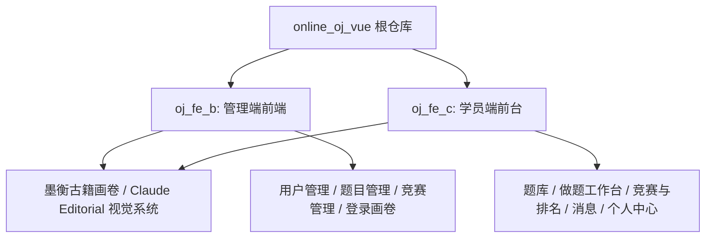

---

## 一、 管理端 (oj_fe_b) 架构与路由流转

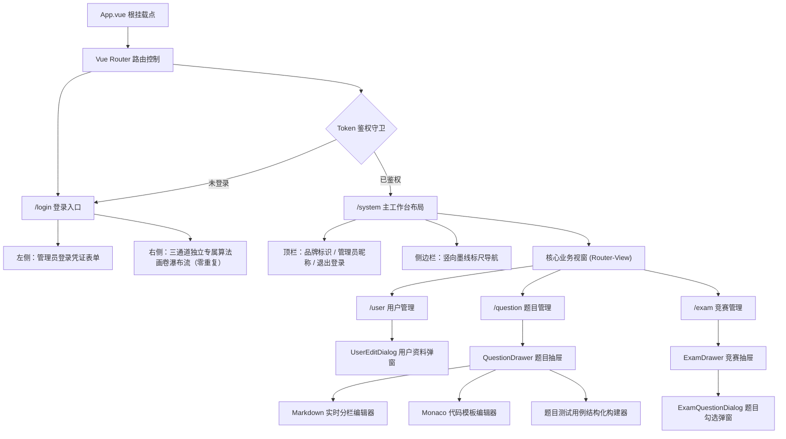

---

## 二、 管理端界面展示与视觉空间

### 1. 登录页与算法画卷瀑布流


### 2. 用户管理主界面


### 3. 题目管理主界面


### 4. 题目编辑抽屉与双栏工作区


### 5. 竞赛管理主界面与状态操作


### 6. 关联竞赛题目弹窗


---

## 三、 管理端核心业务流转闭环

### 1. 竞赛与题目关联闭环

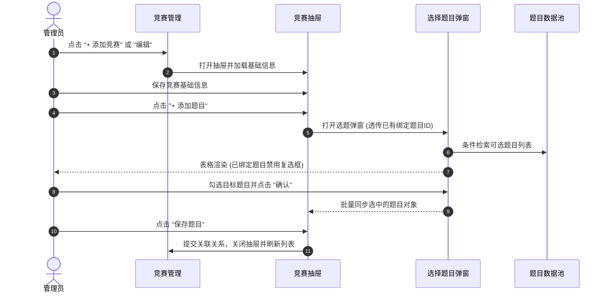

### 2. 题目编辑与测试用例录入闭环

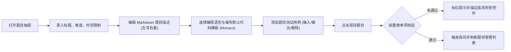

### 3. AI 辅助出题

题目抽屉顶部的「AI 生成题面」与用例区的「AI 生成用例」只回填表单，保存仍走原有流程。

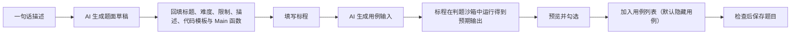

---

## 四、 学员端 (oj_fe_c) 架构与路由流转

### 1. 路由与页面

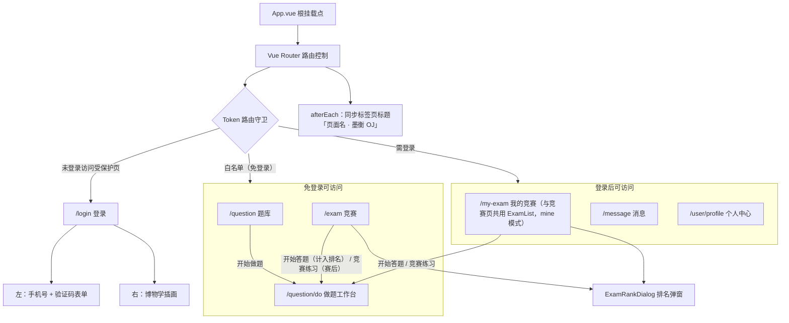

### 2. 工程分层

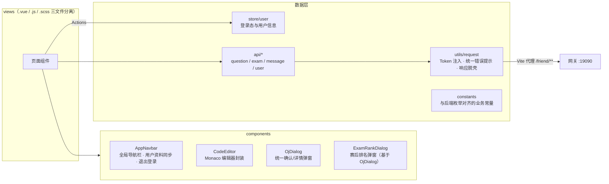

### 3. 做题工作台布局

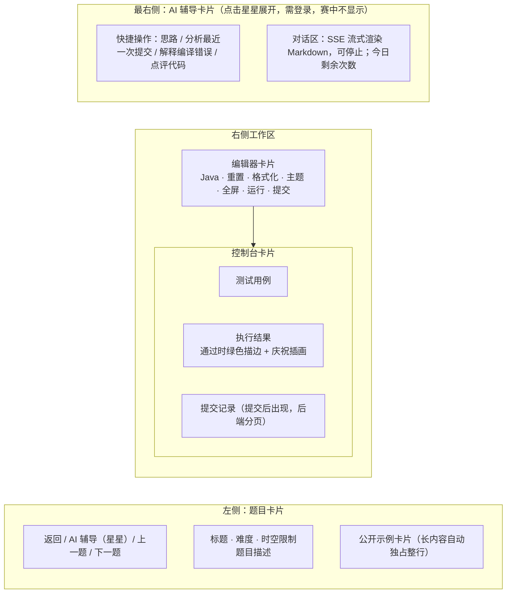

题库关键词无匹配时，后端返回语义推荐结果（`semantic` 标记），列表顶部提示"以下为相关推荐"；做题页题目卡片在登录且非竞赛模式时展示"你可能还想做"。

AI 辅导走 `src/utils/sse.js`（fetch 读取 SSE，携带令牌；校验失败时后端直接返回 JSON 错误）。快捷操作按本题最近一次提交的判题状态出现，提交完成后自动刷新。

---

## 五、 学员端界面展示与视觉空间

### 1. 登录页


### 2. 题库


### 3. 做题工作台


### 4. 运行结果（逐用例对比）


### 5. 提交结果与全部通过


### 6. 提交记录


### 7. 竞赛列表


### 8. 竞赛排名弹窗


### 9. 我的竞赛


### 10. 消息


### 11. 个人中心


---

## 六、 学员端核心业务流转闭环

### 1. 手机号验证码登录

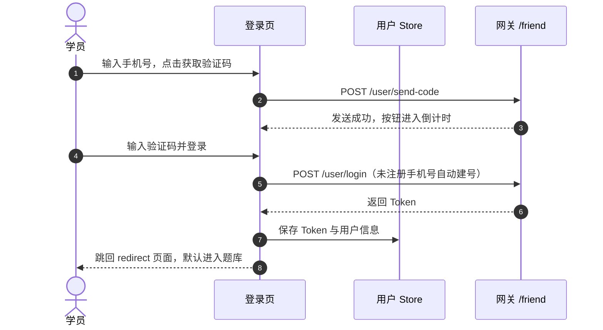

### 2. 运行与提交

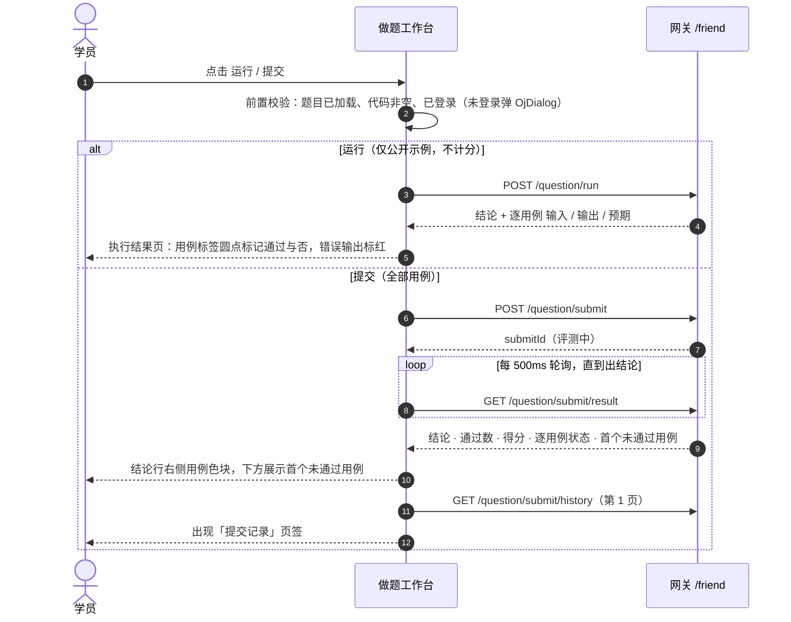

### 3. 执行结果状态

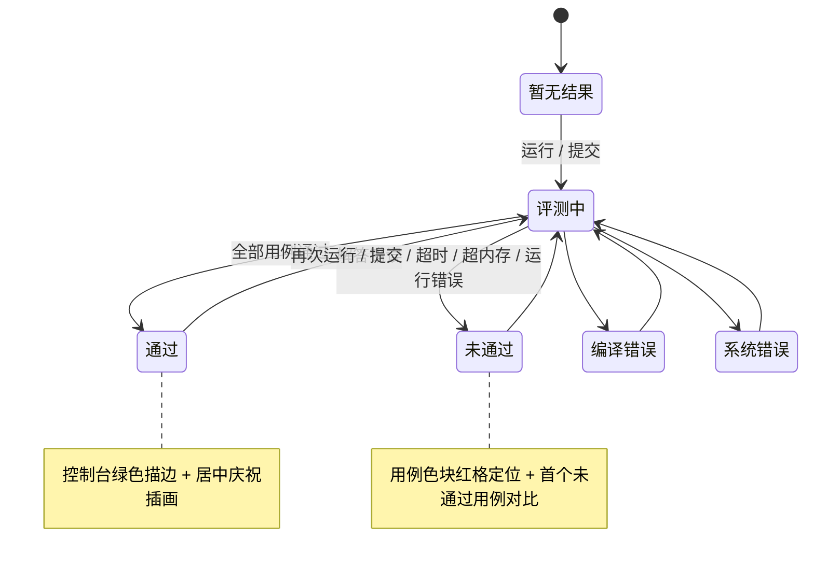

### 4. 提交记录与载回代码

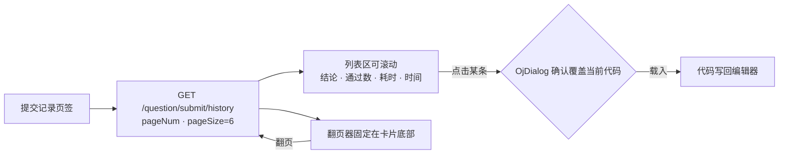

### 5. 竞赛报名、参赛与赛后练习

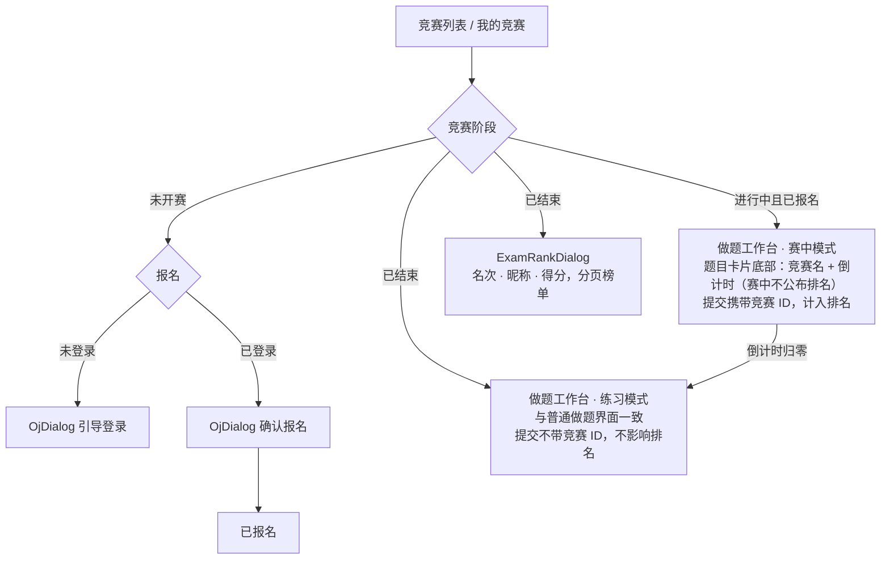

---

## 七、 本地运行指南

```bash
# 管理端（默认端口 5173）
cd oj_fe_b
npm install
npm run dev

# 学员端（默认端口 5174，/friend 请求代理到网关 127.0.0.1:19090）
cd oj_fe_c
npm install
npm run dev

# 生产环境打包（两端相同）
npm run build
```

服务启动后访问：管理端 `http://localhost:5173`，学员端 `http://localhost:5174`。
