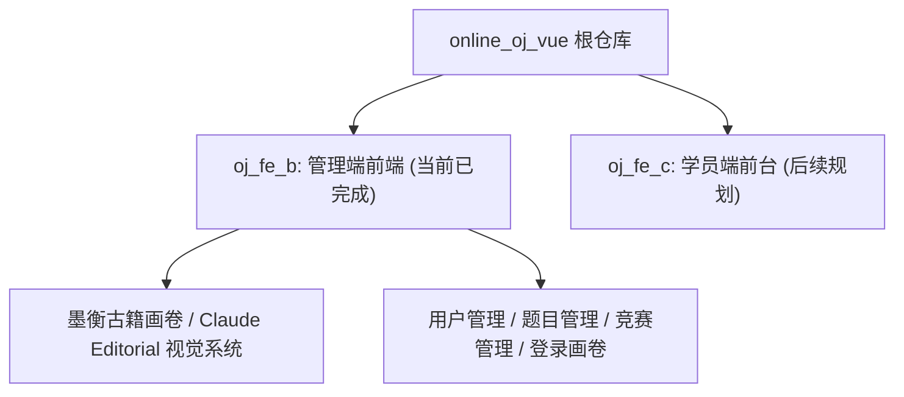
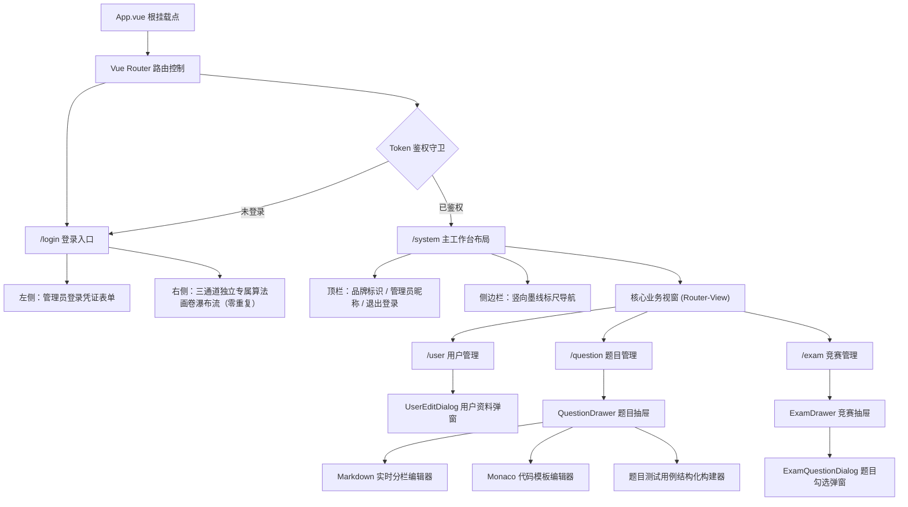
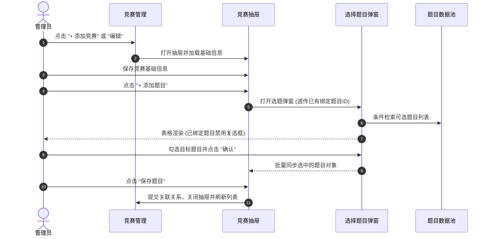
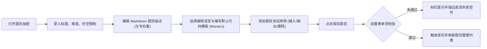

# 墨衡在线 OJ · 前端工程仓库 (online_oj_vue)

> 本仓库包含“墨衡 OJ”系统的多端前端工程。当前阶段重点交付 **B 端后台管理系统 (`oj_fe_b`)**，C 端竞赛学员前台 (`oj_fe_c`) 将在后续阶段完善。



---

## 一、 管理端 (oj_fe_b) 架构与路由流转



---

## 二、 界面展示与视觉空间 (Screenshots)

### 1. 登录页与算法画卷瀑布流


### 2. 用户管理主界面


### 3. 题目管理主界面


### 4. 题目编辑抽屉与双栏工作区


### 5. 竞赛管理主界面与状态操作


### 6. 关联竞赛题目弹窗


---

## 三、 核心业务流转闭环

### 1. 竞赛与题目关联闭环



### 2. 题目编辑与测试用例录入闭环



---

## 四、 本地运行指南

```bash
# 1. 进入 B 端管理端工程
cd oj_fe_b

# 2. 安装依赖
npm install

# 3. 启动开发服务
npm run dev

# 4. 生产环境打包
npm run build
```
服务启动后访问：`http://localhost:5173`。
