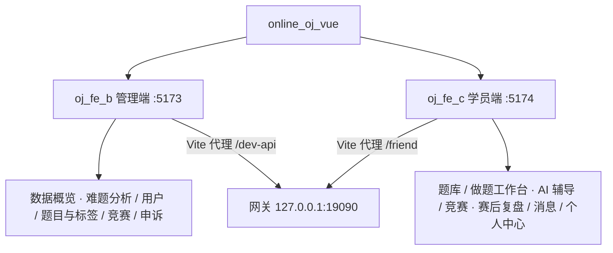
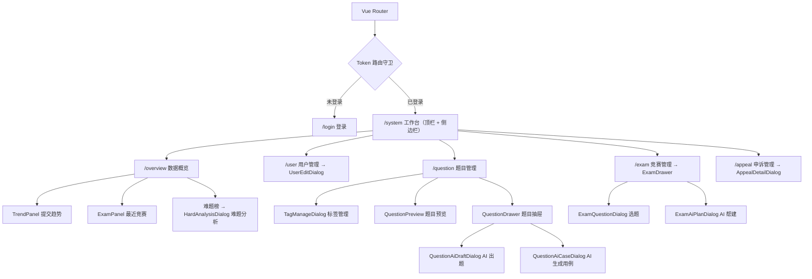
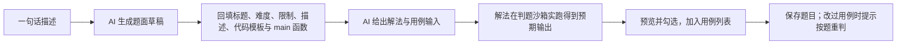
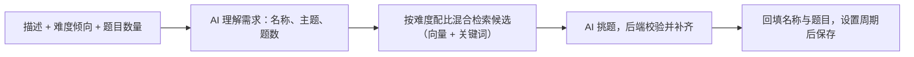
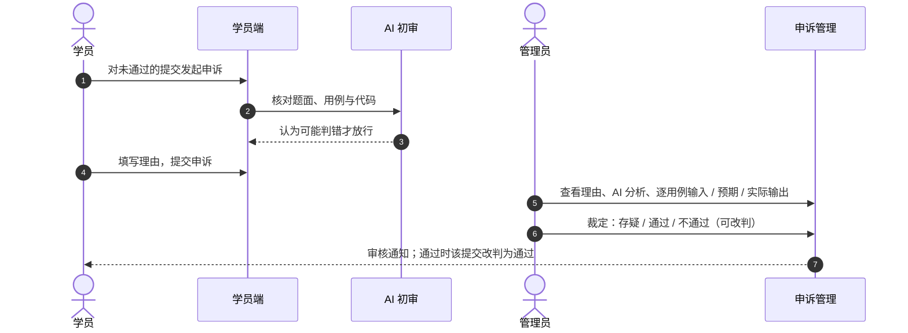
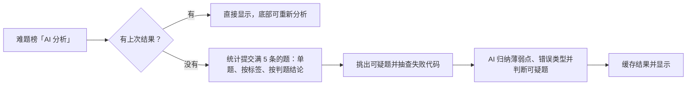
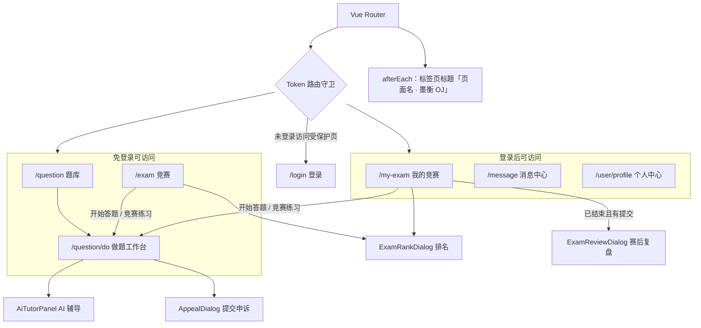
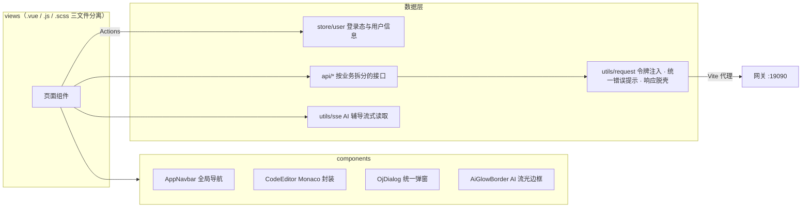
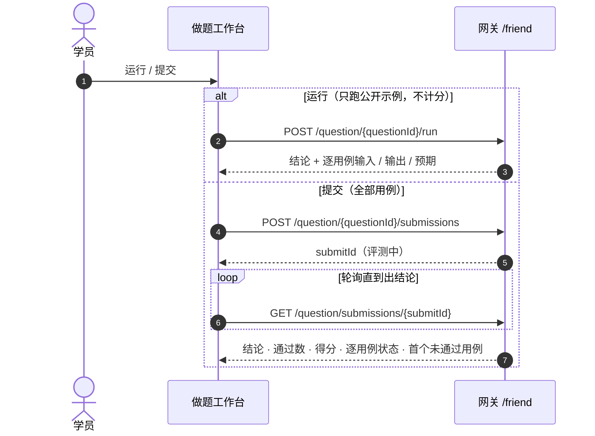
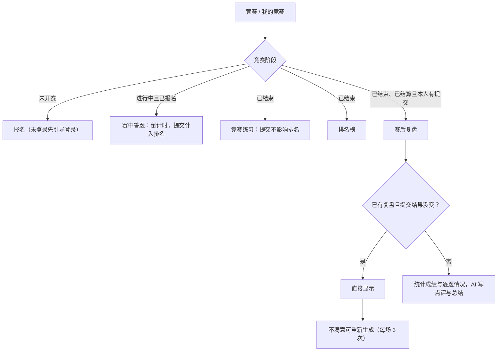

# 墨衡 OJ · 前端工程（online_oj_vue）

> 墨衡 OJ 是一个微服务在线判题平台：学员在学员端刷题、参加竞赛，用 AI 辅导解题、赛后复盘；管理员在管理端管理题目、竞赛、用户与申诉，用 AI 辅助出题、帮建竞赛、分析难题。
>
> 本仓库只包含两个前端工程：**管理端 `oj_fe_b`** 与 **学员端 `oj_fe_c`**。后端微服务（网关、C 端、B 端、判题、定时任务、AI）在独立仓库 `online_oj`。


```mermaid
graph TD
    Repo["online_oj_vue"] --> B["oj_fe_b 管理端 :5173"]
    Repo --> C["oj_fe_c 学员端 :5174"]
    B --> BM["数据概览 · 难题分析 / 用户 / 题目与标签 / 竞赛 / 申诉"]
    C --> CM["题库 / 做题工作台 · AI 辅导 / 竞赛 · 赛后复盘 / 消息 / 个人中心"]
    B -- "Vite 代理 /dev-api" --> GW["网关 127.0.0.1:19090"]
    C -- "Vite 代理 /friend" --> GW
```

---

## 一、功能一览

### 管理端（oj_fe_b）

| 模块 | 功能 |
|---|---|
| 数据概览 | 今日与近 7 天的提交数、活跃用户；提交趋势（近 7 天 / 14 天 / 一个月按天，近半年按周，近一年按半月）；最近竞赛的报名与参赛统计；难题榜 |
| 难题分析 | 对提交满 5 条的题做整体分析：出题质量提醒（失败集中在单个用例或申诉成立的题）、按标签的通过率最低 / 最高饼图、主要错误类型；数字由 SQL 统计，文字结论由 AI 归纳，结果缓存，手动重新分析 |
| 用户管理 | 学员列表检索、资料查看、拉黑与解禁 |
| 题目管理 | 题目增删改查、标签管理、题目预览（与学员端题面一致）；Markdown 题面、Monaco 代码模板、结构化用例、官方题解；AI 出题、AI 生成用例（标程在判题沙箱实跑得到输出）、AI 解法示例、AI 生成题解；修改用例后可按题重判 |
| 竞赛管理 | 竞赛创建、选题、发布与撤销；AI 帮建（按描述、难度倾向与题量挑题） |
| 申诉管理 | 查看学员申诉（申诉理由、AI 初审分析、代码与逐用例输入 / 预期 / 实际输出），裁定为存疑、通过（改判为通过并通知学员）或不通过 |

### 学员端（oj_fe_c）

| 模块 | 功能 |
|---|---|
| 登录 | 手机号验证码登录，未注册自动建号 |
| 题库 | 难度、标签、关键词筛选；关键词无结果时给出语义推荐，长句检索融合关键词与语义结果；做题统计 |
| 做题工作台 | 题面与官方题解、Monaco 编辑器、运行示例、提交判题、逐用例结果、提交记录与载回代码、跨设备代码草稿；对判错有异议时可提交申诉（先经 AI 初审） |
| AI 辅导 | 指点迷津、优化思路、分析最近一次提交、解释编译错误、点评代码与自由提问，SSE 流式输出，只给思路不给完整代码 |
| 竞赛 | 竞赛列表、报名、赛中答题（倒计时、计入排名）、赛后练习、排名榜 |
| 赛后复盘 | 「我的竞赛」中已结束且有提交的竞赛，封面右上角打开复盘：成绩概览、AI 总结、逐题回顾与点评；每场可重新生成 3 次 |
| 消息中心 | 系统通知、竞赛通知（战报）、审核通知（申诉结果），已读未读 |
| 个人中心 | 资料编辑、头像、做题统计与能力雷达 |

---

## 二、界面展示

### 管理端

#### 登录


#### 数据概览


#### 难题分析


#### 用户管理


#### 题目管理


#### 题目编辑与 AI 出题


#### 竞赛管理与 AI 帮建


#### 申诉管理


### 学员端

#### 登录


#### 题库


#### 做题工作台与 AI 辅导


#### 提交申诉


#### 竞赛与排名


#### 赛后复盘


#### 个人中心


---

## 三、管理端架构

### 1. 路由与页面


```mermaid
flowchart TD
    Router["Vue Router"] --> Guard{"Token 路由守卫"}
    Guard --"未登录"--> Login["/login 登录"]
    Guard --"已登录"--> Layout["/system 工作台（顶栏 + 侧边栏）"]

    Layout --> Overview["/overview 数据概览"]
    Overview --> Trend["TrendPanel 提交趋势"]
    Overview --> ExamPanel["ExamPanel 最近竞赛"]
    Overview --> Hard["难题榜 → HardAnalysisDialog 难题分析"]

    Layout --> User["/user 用户管理 → UserEditDialog"]

    Layout --> Question["/question 题目管理"]
    Question --> Tag["TagManageDialog 标签管理"]
    Question --> Preview["QuestionPreview 题目预览"]
    Question --> Drawer["QuestionDrawer 题目抽屉"]
    Drawer --> AiDraft["QuestionAiDraftDialog AI 出题"]
    Drawer --> AiCase["QuestionAiCaseDialog AI 生成用例"]

    Layout --> Exam["/exam 竞赛管理 → ExamDrawer"]
    Exam --> ExamQ["ExamQuestionDialog 选题"]
    Exam --> AiPlan["ExamAiPlanDialog AI 帮建"]

    Layout --> Appeal["/appeal 申诉管理 → AppealDetailDialog"]
```

### 2. AI 辅助出题

题目抽屉里的「AI 出题」「AI 生成用例」「AI 解法示例」「AI 生成题解」只回填表单，保存仍走原有流程；生成中弹窗或区域边框播放流光。


```mermaid
flowchart LR
    Desc["一句话描述"] --> Draft["AI 生成题面草稿"]
    Draft --> Fill["回填标题、难度、限制、描述、代码模板与 main 函数"]
    Fill --> Gen["AI 给出解法与用例输入"]
    Gen --> Run["解法在判题沙箱实跑得到预期输出"]
    Run --> Pick["预览并勾选，加入用例列表"]
    Pick --> Save["保存题目；改过用例时提示按题重判"]
```

### 3. AI 帮建竞赛


```mermaid
flowchart LR
    Input["描述 + 难度倾向 + 题目数量"] --> Intent["AI 理解需求：名称、主题、题数"]
    Intent --> Recall["按难度配比混合检索候选（向量 + 关键词）"]
    Recall --> Pick["AI 挑题，后端校验并补齐"]
    Pick --> Fill["回填名称与题目，设置周期后保存"]
```

### 4. 申诉处理


```mermaid
sequenceDiagram
    autonumber
    actor S as 学员
    participant C as 学员端
    participant AI as AI 初审
    actor A as 管理员
    participant B as 申诉管理

    S->>C: 对未通过的提交发起申诉
    C->>AI: 核对题面、用例与代码
    AI-->>C: 认为可能判错才放行
    S->>C: 填写理由，提交申诉
    A->>B: 查看理由、AI 分析、逐用例输入 / 预期 / 实际输出
    A->>B: 裁定：存疑 / 通过 / 不通过（可改判）
    B-->>S: 审核通知；通过时该提交改判为通过
```

### 5. 难题分析


```mermaid
flowchart LR
    Open["难题榜「AI 分析」"] --> Cache{"有上次结果？"}
    Cache --"有"--> Show["直接显示，底部可重新分析"]
    Cache --"没有"--> Stat["统计提交满 5 条的题：单题、按标签、按判题结论"]
    Stat --> Suspect["挑出可疑题并抽查失败代码"]
    Suspect --> AI["AI 归纳薄弱点、错误类型并判断可疑题"]
    AI --> Save["缓存结果并显示"]
```

---

## 四、学员端架构

### 1. 路由与页面


```mermaid
flowchart TD
    Router["Vue Router"] --> Guard{"Token 路由守卫"}
    Router --> Title["afterEach：标签页标题「页面名 · 墨衡 OJ」"]

    subgraph Public["免登录可访问"]
        QList["/question 题库"]
        QDo["/question/do 做题工作台"]
        EList["/exam 竞赛"]
    end

    subgraph Private["登录后可访问"]
        MyExam["/my-exam 我的竞赛"]
        Msg["/message 消息中心"]
        Profile["/user/profile 个人中心"]
    end

    Guard --> Public
    Guard --> Private
    Guard --"未登录访问受保护页"--> Login["/login 登录"]

    QList --> QDo
    EList --"开始答题 / 竞赛练习"--> QDo
    MyExam --"开始答题 / 竞赛练习"--> QDo
    EList --> Rank["ExamRankDialog 排名"]
    MyExam --> Rank
    MyExam --"已结束且有提交"--> Review["ExamReviewDialog 赛后复盘"]
    QDo --> Tutor["AiTutorPanel AI 辅导"]
    QDo --> AppealDlg["AppealDialog 提交申诉"]
```

### 2. 工程分层


```mermaid
flowchart LR
    subgraph View["views（.vue / .js / .scss 三文件分离）"]
        Pages["页面组件"]
    end
    subgraph Comp["components"]
        Navbar["AppNavbar 全局导航"]
        Editor["CodeEditor Monaco 封装"]
        Dialog["OjDialog 统一弹窗"]
        Glow["AiGlowBorder AI 流光边框"]
    end
    subgraph Data["数据层"]
        Store["store/user 登录态与用户信息"]
        Api["api/* 按业务拆分的接口"]
        Request["utils/request 令牌注入 · 统一错误提示 · 响应脱壳"]
        Sse["utils/sse AI 辅导流式读取"]
    end
    Pages --> Comp
    Pages --"Actions"--> Store
    Pages --> Api --> Request
    Pages --> Sse
    Request --"Vite 代理"--> Gateway["网关 :19090"]
```

### 3. 运行与提交


```mermaid
sequenceDiagram
    autonumber
    actor U as 学员
    participant Do as 做题工作台
    participant API as 网关 /friend

    U->>Do: 运行 / 提交
    alt 运行（只跑公开示例，不计分）
        Do->>API: POST /question/{questionId}/run
        API-->>Do: 结论 + 逐用例输入 / 输出 / 预期
    else 提交（全部用例）
        Do->>API: POST /question/{questionId}/submissions
        API-->>Do: submitId（评测中）
        loop 轮询直到出结论
            Do->>API: GET /question/submissions/{submitId}
        end
        API-->>Do: 结论 · 通过数 · 得分 · 逐用例状态 · 首个未通过用例
    end
```

### 4. 竞赛与赛后复盘


```mermaid
flowchart TD
    List["竞赛 / 我的竞赛"] --> Phase{"竞赛阶段"}
    Phase --"未开赛"--> Enroll["报名（未登录先引导登录）"]
    Phase --"进行中且已报名"--> Contest["赛中答题：倒计时，提交计入排名"]
    Phase --"已结束"--> Practice["竞赛练习：提交不影响排名"]
    Phase --"已结束"--> Rank["排名榜"]
    Phase --"已结束、已结算且本人有提交"--> Review["赛后复盘"]
    Review --> First{"已有复盘且提交结果没变？"}
    First --"是"--> Show["直接显示"]
    First --"否"--> Gen["统计成绩与逐题情况，AI 写点评与总结"]
    Show --> Regen["不满意可重新生成（每场 3 次）"]
```

---

## 五、目录结构

```text
online_oj_vue
├── oj_fe_b                 管理端
│   └── src
│       ├── api             按业务拆分的接口（overview、question、exam、appeal …）
│       ├── components      通用组件（OjDialog、CodeEditor、MarkdownEditor、AiGlowBorder …）
│       ├── constants       与后端枚举对齐的业务常量
│       ├── styles          全局样式与变量
│       └── views           页面（overview、user、question、exam、appeal）
└── oj_fe_c                 学员端
    └── src
        ├── api
        ├── components      AppNavbar、AiTutorPanel、AppealDialog …
        ├── constants
        ├── store           登录态
        ├── utils           request、sse、题面解析 …
        └── views           页面（question、exam、message、user）
```

组件统一拆成 `.vue` / `.js` / `.scss` 三个文件；页面通过 `src/api/` 发请求，不直接调用 Axios。

---

## 六、本地运行

```bash
# 管理端（http://localhost:5173）
cd oj_fe_b
npm install
npm run dev

# 学员端（http://localhost:5174）
cd oj_fe_c
npm install
npm run dev

# 生产环境打包（两端相同，产物在各自的 dist/）
npm run build
```

- 两端都经 Vite 代理访问网关 `127.0.0.1:19090`，后端的启动方式见后端仓库 README。
- 后端初始化脚本 `deploy/db_sql/oj_init.sql` 自带演示数据：20 个学员、30 道题（含用例、标签与题解）、6 场不同状态的竞赛、近一年约 780 条提交、若干申诉与站内消息。
- 测试账号：管理端 `admin / 123456`；学员端手机号 `13800000001` ~ `13800000020`（`13800000008` 为拉黑账号）。本地为模拟发码，验证码输出在 oj-friend 控制台。
- `src/assets` 为图片素材，随仓库提供。
