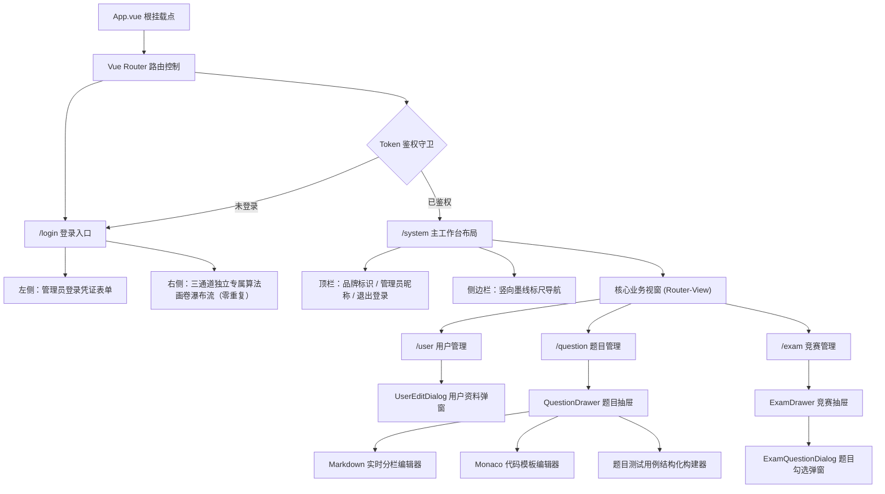
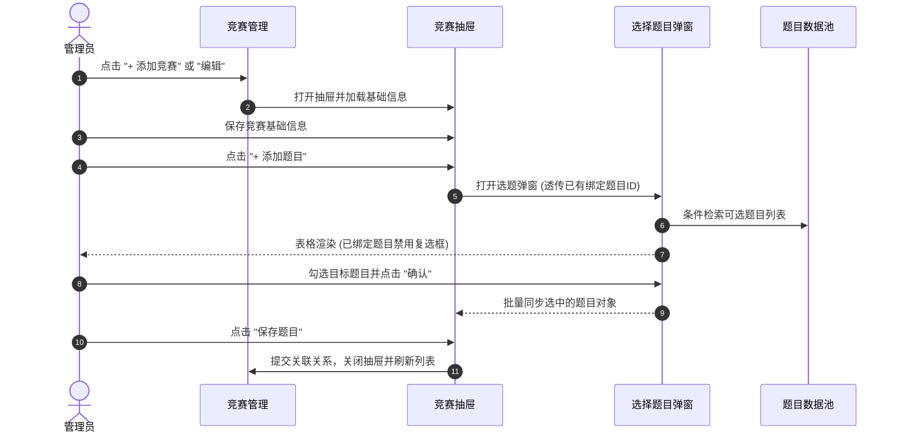
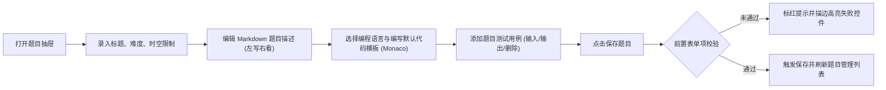
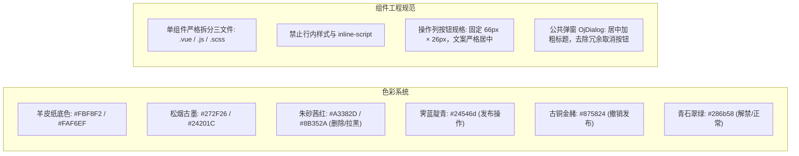

# 墨衡 OJ · 管理端前端工程 (oj_fe_b)

> 基于 Vue 3 + Vite 构建的算法竞赛与代码评测后台管理系统。遵循“墨衡古籍画卷 / Claude Editorial”设计语言，采用沉稳羊皮纸底色、古典松烟深墨与矿物印泥色彩体系。

---

## 一、 系统架构与路由流转



---

## 二、 界面展示与视觉空间

### 1. 登录与画卷瀑布流


### 2. 用户管理与资料编辑


### 3. 题目管理与综合检索


### 4. 题目编辑抽屉与代码/用例工作台


### 5. 竞赛管理与状态流转


### 6. 选择竞赛题目多选弹窗


---

## 三、 核心业务流转流程

### 1. 竞赛与题目关联闭环



### 2. 题目编辑与测试用例录入闭环



---

## 四、 前端设计系统规范（墨衡古籍画卷）



---

## 五、 本地开发与构建指南

### 1. 环境准备
- Node.js >= 18.0.0
- npm >= 9.0.0

### 2. 依赖安装与启动
```bash
# 进入管理端工程目录
cd oj_fe_b

# 安装依赖
npm install

# 启动本地开发服务 (支持 HMR 热重载)
npm run dev
```
启动成功后，浏览器访问 `http://localhost:5173` 即可进入登录页。

### 3. 生产打包
```bash
# 构建生产环境高压缩静态资源
npm run build
```
编译产物输出至 `oj_fe_b/dist/`，可直接通过 Nginx 等静态 Web 服务器托管。
